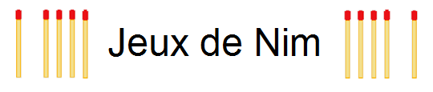
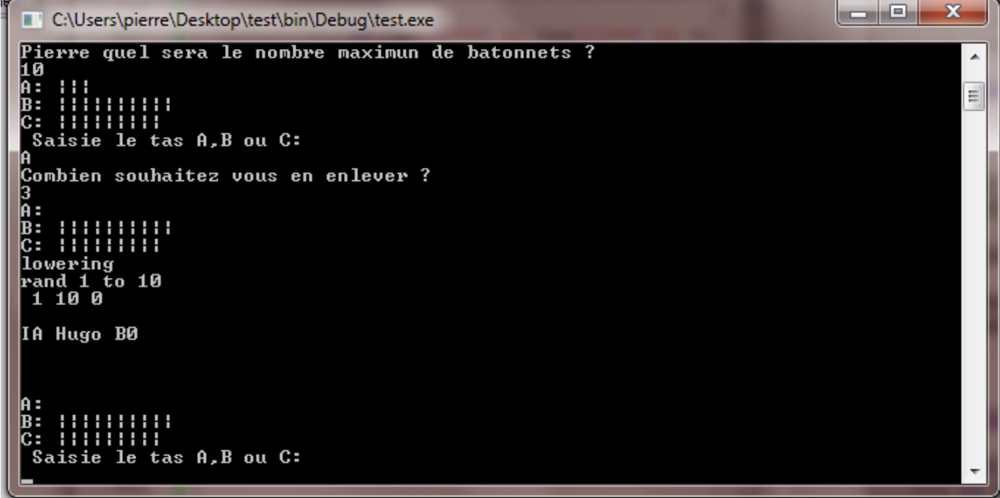

<h1 align="center">
  
</h1>

---

# JEUX DE NIM

## Règle du jeux
- Les joueurs tirent à tour de rôle autant de bâtonnets qu’ils souhaitent dans 3 tas distincts. 
- Le joueur qui retire le dernier bâtonnet gagne la partie.

## Techno
- C++
- CodeBlocks

## UI

## Auteur
- [@Pierre](https://github.com/Pierre-Portfolio)
- [@Nessotrin](https://github.com/nessotrin)